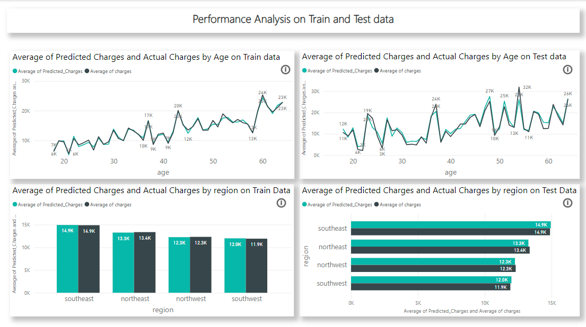
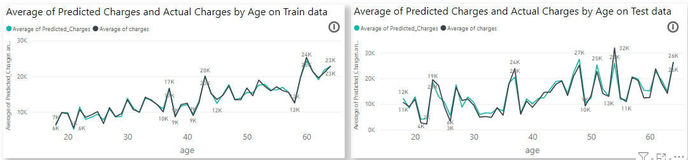
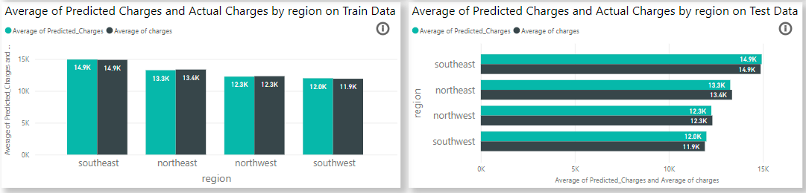

# AutoML Cashflow Optimization for Insurance Company 🚀
 
Predicting medical insurance charges from customer demographics and health risk factors, using AutoML for model selection and Power BI for interactive visualization.
 
An insurance company's cash flow depends heavily on how accurately it can forecast future patient charges. This project builds an AutoML-powered pipeline that automatically trains, compares, and selects the best regression model to predict medical costs — then surfaces the results in a Power BI dashboard so underwriting and pricing teams can explore cost-driving patterns without touching code.
 
---
 
## Table of Contents
 
- [Problem Statement](#problem-statement)
- [Dataset](#dataset)
- [Tech Stack](#tech-stack)
- [Project Structure](#project-structure)
- [How It Works](#how-it-works)
- [Model Performance](#model-performance-)
- [Dashboard Insights](#dashboard-insights)
  - [Age-based Analysis](#age-based-analysis)
  - [Region-based Analysis](#region-based-analysis)
- [Getting Started](#getting-started)
- [Business Value](#business-value)
- [Future Improvements](#future-improvements)
- [Contributing](#contributing-)
- [License](#license-)
---
 
## Problem Statement
 
Insurance companies need reliable forecasts of medical charges to price policies correctly, manage risk during underwriting, and plan cash flow. Manually building and tuning multiple regression models is slow and requires ML expertise that not every analyst has. This project uses **AutoML** to automate model selection, so the "best" model (by RMSE / R²) is chosen from a pool of candidates automatically, and the results are made accessible to non-technical stakeholders through a BI dashboard.
 
## Dataset
 
[Medical Cost Personal Dataset](https://www.kaggle.com/datasets/mirichoi0218/insurance) (Kaggle) — 1,338 records with the following fields:
 
| Column | Description |
|---|---|
| `age` | Age of the primary beneficiary |
| `sex` | Gender (male / female) |
| `bmi` | Body Mass Index |
| `children` | Number of dependents covered by the insurance plan |
| `smoker` | Smoking status (yes / no) |
| `region` | Residential area in the US (northeast, northwest, southeast, southwest) |
| `charges` | Individual medical costs billed by health insurance — **target variable** |
 
## Tech Stack
 
- **PyCaret** — AutoML library used for `setup()` and `compare_models()` to train and benchmark multiple regressors
- **Python** — data prep and model training (embedded via Power BI's Python scripting integration)
- **Power BI Desktop** — dashboard, Power Query data cleaning/transformation, visualization
- **Pandas / Scikit-learn** — underlying data handling and modeling (via PyCaret)
## Project Structure
 
```
AutoML-Cashflow-Optimization-for-Insurance-Company/
├── insurance.csv                # Raw dataset
├── best-model-powerbi.pkl       # Serialized best-performing model (from PyCaret compare_models)
├── Automl.pbix                  # Power BI dashboard file
├── screenshots/                 # Dashboard screenshots used in this README
│   ├── modelperformance.png
│   ├── Agebasedanalysis.png
│   └── Regionbasedanalysis.png
└── README.md
```
 
## How It Works
 
1. **Data Import & Cleaning** — `insurance.csv` is loaded into Power BI via Power Query. Nulls are checked, data types validated, and variables like age and BMI are optionally binned into categories for easier segmentation.
2. **AutoML Model Training** — A Python script (using PyCaret) runs `setup()` to configure the regression environment, then `compare_models()` to train and benchmark several algorithms (Linear Regression, Random Forest, Gradient Boosting, etc.) against RMSE and R².
3. **Model Selection & Export** — The best-performing model is saved as `best-model-powerbi.pkl` and used to generate predictions for every record in the dataset.
4. **Visualization** — Predictions and actuals are brought back into Power BI (`Automl.pbix`) for exploration via bar charts, bubble charts, comparison tables, KPI cards, and slicers.
## Model Performance 🔍
 
Across the models evaluated, **Gradient Boosting Regressor** came out on top:
 

 
| Metric | Value |
|---|---|
| R² Score | 83.20% |
| Mean Absolute Error (MAE) | 2,701.99 |
| Mean Squared Error (MSE) | 23,548,981.36 |
| Root Mean Squared Error (RMSE) | 4,832.97 |
| Training Time (TT) | 0.04 seconds |
 
## Dashboard Insights
 
### Age-based Analysis
 
Predicted vs. actual charges broken down by age group, across both training and test data — useful for spotting where the model over- or under-predicts for specific age bands.
 

 
### Region-based Analysis
 
Predicted vs. actual charges compared across the four regions (northeast, northwest, southeast, southwest), highlighting geographic consistency (or inconsistency) in model accuracy.
 

 
> **Dashboard also includes:** bubble charts relating smoking status, BMI, and predicted charges; KPI cards for total projected charges and average prediction error; and slicers to filter by region, gender, and smoker status.
 
## Getting Started
 
**Prerequisites**
- Power BI Desktop (Windows)
- Python 3.x with PyCaret installed (`pip install pycaret`), if you want to re-run the AutoML step
- Python integration enabled in Power BI (*File → Options → Python scripting*)
**Steps**
1. Clone this repository.
2. Open `Automl.pbix` in Power BI Desktop to explore the pre-built dashboard directly, **or**
3. To retrain the model yourself: load `insurance.csv`, run a PyCaret script with `setup(data, target='charges')` followed by `compare_models()`, and export the winning model as a `.pkl` file.
4. Point Power BI's Python script step at your retrained model to refresh predictions.
## Business Value
 
- **Pricing** — More accurate cost forecasts support fairer, more competitive premium pricing.
- **Underwriting** — Identifying which features (age, BMI, smoking status) drive costs most helps refine risk assessment.
- **Customer Segmentation** — Region/demographic breakdowns highlight segments with higher or more volatile costs.
- **Cash Flow Planning** — Aggregated projected charges feed directly into forecasting future claim payouts.
## Future Improvements
 
- Automate model retraining on a schedule (e.g., via Power BI dataflows or Azure ML pipelines)
- Add confidence intervals around predictions, not just point estimates
- Expand feature set with additional risk variables if more data becomes available
- Deploy the model as a REST API for real-time quote generation
## Contributing 🤝
 
Contributions are welcome! Whether it's improving the existing models, adding new features, or refining the visualizations, feel free to open an issue or submit a pull request.
 
## License 📄
 
This project is licensed under the MIT License. See the `LICENSE` file for more details.
